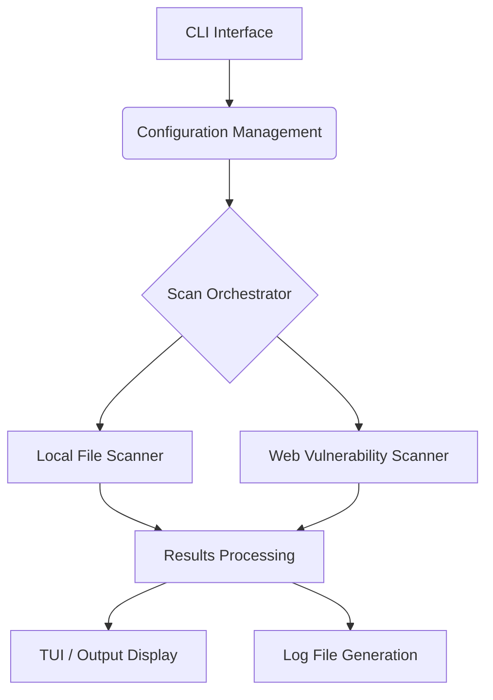

# RIP Project Architecture Overview

## 1. Introduction

This document outlines the high-level architecture and design principles of the RIP (Rest In Peace, Vulnerabilities) security scanning tool. RIP is built with Rust to leverage its performance, memory safety, and concurrency features, providing a fast, reliable, and extensible solution for identifying sensitive data leaks and security misconfigurations.

## 2. Design Principles

*   **Performance First:** Optimized for speed, especially for file scanning, using Rust's native performance and efficient libraries.
*   **Security by Design:** The tool itself is built with security best practices in mind, minimizing its own attack surface.
*   **Modularity & Extensibility:** Clear separation of concerns allows for easy addition of new scanning modules, output formats, and configuration options.
*   **Developer Experience:** Provides a user-friendly command-line interface and an interactive Terminal User Interface (TUI) for ease of use.
*   **Transparency:** Open-source with clear documentation and reporting.

## 3. High-Level Architecture

RIP follows a modular architecture, primarily composed of the following key components:

### 3.1. CLI Interface (`src/cli.rs`)

*   **Purpose:** Handles command-line argument parsing and subcommand dispatch using the `clap` crate.
*   **Responsibilities:** Defines the available commands (`scan`, `config`, `version`), flags (`--auto`, `--config`, `--reconfigure`, `--skip-config`), and their respective arguments.
*   **Interaction:** Serves as the primary entry point for user interaction, translating CLI commands into internal application logic.

### 3.2. Configuration Management (`src/config.rs`)

*   **Purpose:** Manages application settings, loaded from `.ripconfig.toml` or provided via CLI arguments.
*   **Responsibilities:**
    *   Loading configuration from a TOML file using `serde` and `toml`.
    *   Saving configuration to a TOML file.
    *   Providing default configuration values.
    *   Parsing `.env` files to extract environment variable keys for scanning, with filtering for trivial values.
*   **Interaction:** The `main` function and `tui` module interact with this component to load, modify, and save settings.

### 3.3. Scan Orchestrator (`src/main.rs`)

*   **Purpose:** Coordinates the overall scanning process based on the loaded configuration and CLI commands.
*   **Responsibilities:**
    *   Loading and applying configuration.
    *   Dispatching to the appropriate scanner modules (local file or web).
    *   Handling the overall flow of the application, including interactive setup and result display.
*   **Interaction:** Acts as the central hub, connecting the CLI, configuration, and scanner modules.

### 3.4. Local File Scanner (`src/scanner.rs`)

*   **Purpose:** Performs fast, multi-threaded scanning of local repository files for sensitive data.
*   **Responsibilities:**
    *   Collecting files based on configured extensions and ignore patterns.
    *   Utilizing `grep-searcher` for efficient pattern matching within files.
    *   Identifying and reporting `ScanMatch` instances (file path, line number, matched content, environment key).
    *   Generating a temporary log file of scan results.
*   **Interaction:** Receives configuration from the orchestrator and provides raw scan results.

### 3.5. Web Vulnerability Scanner (`src/web_scanner.rs`)

*   **Purpose:** Conducts checks for common web vulnerabilities and misconfigurations on a given public URL.
*   **Responsibilities:**
    *   Making HTTP requests using the `reqwest` crate.
    *   Checking for exposed sensitive files (e.g., `.env`, `.git/config`).
    *   Analyzing HTTP security headers.
    *   Inspecting `robots.txt` for information disclosure.
    *   Reporting `WebVulnerability` instances (URL, type, severity, description, recommendation).
*   **Interaction:** Receives configuration (including the target URL) from the orchestrator and provides web scan results.

### 3.6. Results Processing & Output (`src/tui.rs`, `src/scanner.rs`, `src/web_scanner.rs`)

*   **Purpose:** Formats and displays scan results to the user, both in the terminal and in log files.
*   **Responsibilities:**
    *   `src/tui.rs`: Handles the interactive setup and general terminal output, including ASCII art and styled messages using `colored` and `dialoguer`.
    *   `src/scanner.rs`: Contains `display_results` for local file scan findings, grouping by file and highlighting issues.
    *   `src/web_scanner.rs`: Contains `display_web_results` for web scan findings, categorized by severity.
    *   Log file generation: Both scanners contribute to creating detailed log files in `/tmp/`.
*   **Interaction:** Receives processed `ScanMatch` and `WebVulnerability` data and presents it to the user.

## 4. Data Flow

1.  **Initialization:** CLI arguments are parsed, and configuration is loaded or interactively set up.
2.  **Scan Execution:** Based on configuration, the orchestrator triggers either the local file scanner, the web scanner, or both.
3.  **Scanning:** Scanners perform their respective checks, identifying potential vulnerabilities.
4.  **Result Collection:** Raw scan matches/vulnerabilities are collected by the scanners.
5.  **Reporting:** Results are formatted, displayed in the terminal, and written to log files.

## 5. External Dependencies (Crates)

RIP leverages several high-quality Rust crates to achieve its functionality:

*   **`clap`**: Command-line argument parsing.
*   **`serde` & `toml`**: Configuration serialization/deserialization.
*   **`dialoguer`**: Interactive TUI elements (prompts, multi-selects).
*   **`colored`**: Terminal text styling and coloring.
*   **`indicatif`**: Progress bars and spinners.
*   **`grep-searcher`, `grep-matcher`, `grep-regex`**: Fast, multi-threaded file content searching (core of local scanner).
*   **`reqwest`**: Asynchronous HTTP client for web requests.
*   **`tokio`**: Asynchronous runtime for `reqwest` and other async operations.
*   **`anyhow`**: Ergonomic error handling.
*   **`chrono`**: Date and time utilities for logging.
*   **`regex`**: Regular expression engine.

## 6. Future Considerations

*   **Advanced Secret Detection:** Implement entropy analysis and more sophisticated pattern matching.
*   **Git History Scanning:** Integrate a module to analyze Git commit history for exposed secrets.
*   **Extensible Rule Engine:** Allow users to define custom scanning rules.
*   **Alternative Output Formats:** Support JSON, SARIF, or other machine-readable formats for integration with other tools.
*   **Performance Optimization:** Continuous profiling and optimization for large codebases.

This architectural overview provides a foundation for understanding RIP's structure and design philosophy. Further detailed design documents will delve into specific components as needed.